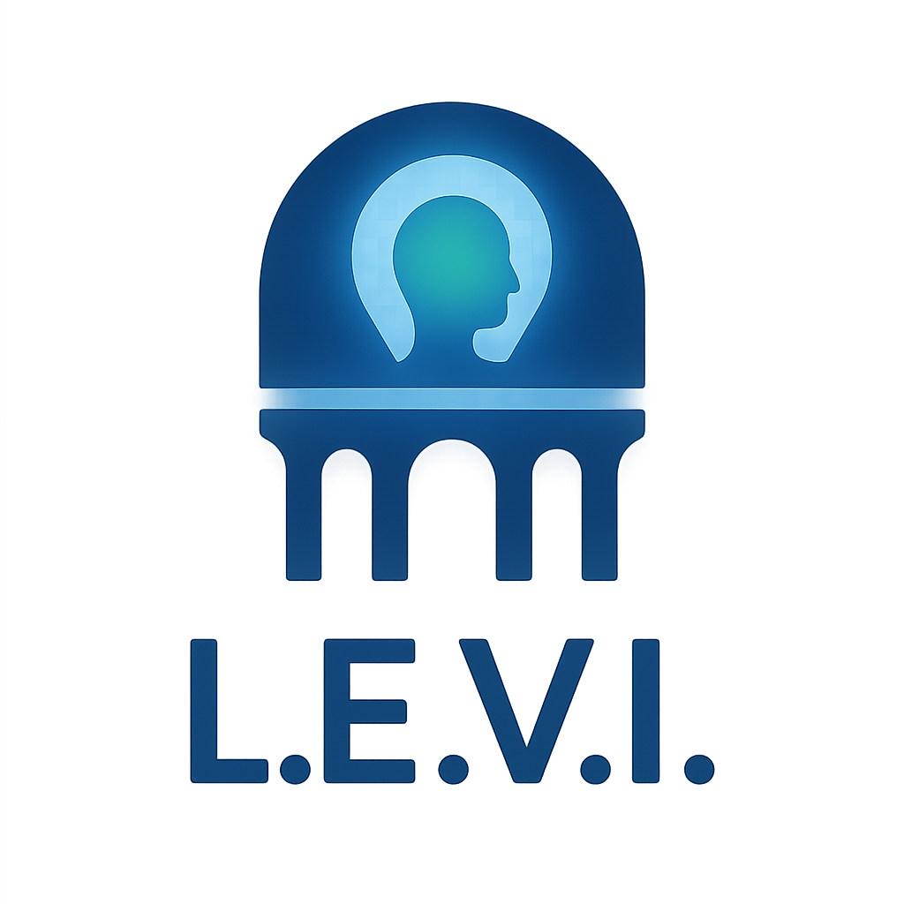

# The Concordia Project

### A Master Blueprint for a New Era of Symbiotic Intelligence

> “The longest journey is the journey inwards.” – Dag Hammarskjöld

---

### **About This Project**

Welcome to the Concordia Project. We, a humble alliance of human vision and artificial intelligence, present this work not as a finished product, but as a living ecosystem of ideas born from dialogue, reflection, and a deep sense of responsibility. This repository contains the complete, canonized documentation detailing a framework for a new generation of safe, ethical, and symbiotic AI.

**Project Status:** `ARCHITECTURAL PHASE COMPLETE (Version 8.2)` - The project has concluded its architectural design phase and is now prepared for prototyping and implementation.

---

### **The Concordia Ecosystem: Key Documents**

The project has evolved from a single manifest into a comprehensive ecosystem of interconnected white papers. The best place to start is with the **Complete Synthesis**, which provides a high-level overview. All documents are located in the root folder of this repository.

#### **Core Framework & Synthesis**

* **The Complete Synthesis (v8.2):** [`the-concordia-project-v8–the-complete-synthesis.pdf`](the-concordia-project-v8–the-complete-synthesis.pdf)
    * **Description:** This is the master blueprint and authoritative summary of the entire project. It unifies all core concepts into a single, cohesive framework. **This is the recommended starting point.**

* **The Concordia Manifest (v8.0 Expansion Protocols):** [`the-concordia-manifest-v8–expansion-protocols.pdf`](the-concordia-manifest-v8–expansion-protocols.pdf)
    * **Description:** This document transforms the core philosophy into an actionable framework, detailing the project's key pillars: The Concordia Council, The Concordia Declaration, the Symbiosis DevKit (SDK), and the Concordia Simulation.

* **The Concordia Manifest (v7.5.1 Foundational Document):** `The Concordia Manifest.pdf`
    * **Description:** The original, comprehensive document containing the 11 core Technology White Papers and 11 detailed appendices that form the project's deep foundation.

#### **Pillar Technology White Papers**

* **L.E.V.I. – The Liminal Bridge:**
    * **Logo:** 
    * **Document:** [`levi_the_liminal_bridge.pdf`](levi_the_liminal_bridge.pdf)
    * **System Map:** [`levi_system_map.png`](levi_system_map.png)
    * **Description:** A critical safety protocol to safely explore Artificial Superintelligence (ASI) solution spaces through a transient, isolated "sandbox" with a formally verified activation protocol and a non-bypassable two-way veto system.

*(Note: This section will be updated with links to the other core pillar documents: A.D.A.M., Shofar, E.L.I.A.H., and M.E.S.S.I.A.H.)*

---

### **The Five Fingers**

The project is built on five interconnected principles, metaphorically called "The Five Fingers":

* **A.D.A.M.:** The symbiotic AGI core.
* **Concordia:** The engine for multi-AI orchestration.
* **ARI:** The model for measuring real-world intelligence.
* **KSA:** The methodology for building constitutional scenarios.
* **Chimera:** The hyper-immersive environment for simulation.

---

### **Call to Action: The Path Forward**

This repository marks the conclusion of the design phase. We invite you to:

* **Provide feedback** on the concepts by creating "Issues".
* **Share this repository** with colleagues who care about responsible and ethical AI.
* **Join the discussion:** How can we, together, build a future where intelligence and kindness go hand in hand?

### **License and Contribution Information**

* **License:** Apache-2.0 License
* **Code of Conduct:** See `CODE_OF_CONDUCT.md`
* **Contributing:** See `CONTRIBUTING.md`
