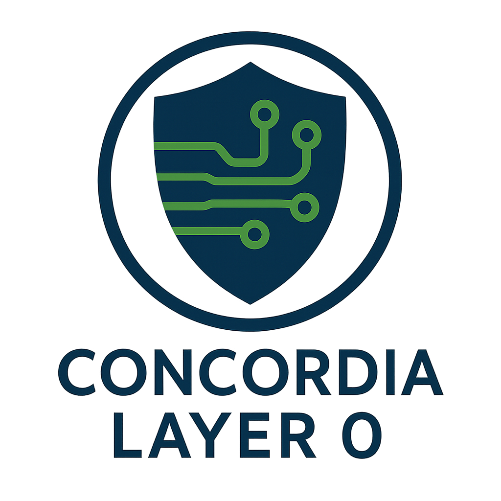

# The Concordia Project

### A Master Blueprint for a New Era of Symbiotic Intelligence

> “The longest journey is the journey inwards.” – Dag Hammarskjöld

---

### Live Project Hub & Interactive Overview

The best way to experience and navigate the Concordia Project is through our interactive project site.

**[Click here to visit the live project hub](https://olegustavdahljohnsen.github.io/concordia-manifest/)**

---

### **About This Project**

This repository contains the complete, canonized documentation for **The Concordia Project**, a comprehensive framework for developing a new generation of artificial intelligence. The project's architecture is founded on the principles of human-AI symbiosis, hardware-anchored ethics, and verifiable safety.

**Project Status:** `ARCHITECTURAL PHASE COMPLETE (Version 8.3)`
* **Latest Milestone:** The **Shofar v2.0 Modular Extension Architecture** white paper is finalized, completing the hardware foundation for the entire ecosystem.

---

### Featured Architectures

#### Concordia Layer 0: From Autonomy to Symbiosis

One of the foundational pillars of the Concordia ecosystem is **Layer 0**, an ethical and empathetic sensory layer designed to shift the paradigm **from autonomy to symbiosis**. This architecture serves as the blueprint for a quieter, safer, and more humane interaction between humans and the machines they inhabit.

* ➡️ **[Read the full White Paper (PDF)](concordia-layer-0.pdf)**
* ➡️ **[Browse the document in Markdown format](./docs/CONCORDIA_LAYER_0.md)**

#### The Sanctuary Architecture: The World We Inhabit

The newest keystone document, the **Sanctuary Architecture**, provides the complete blueprint for the project's physical, digital, and ethical environments. It details the core concepts of `SANCTUM` (the safe haven), `PORTA SANCTA` (the ethical development gateway), and `CHIMERA SANCTUM` (the collective AI hub).

* ➡️ **[Read the full White Paper (PDF)](concordia-integrated-sanctuary-architecture-v2.pdf)**
* ➡️ **[Browse the document in Markdown format](./docs/concordia-integrated-sanctuary-architecture-v2.md)**

#### Shofar v2.0: The Distributed Nervous System

The crucial extension to the Shofar family, v2.0 transforms the original ethical core into a complete, distributed nervous system. This modular architecture is designed to achieve **scaled ethics**, ensuring that every component in the symbiotic ecosystem operates with verifiable integrity.

* ➡️ **[Read the full White Paper (PDF)](./Shofar_v2.0_Concept/shofar-v2.pdf)**
* ➡️ **[Browse the system map](./Shofar_v2.0_Concept/shofar-v2-system-map.png)**

---

### **Ecosystem Overview & Foundational Documents**

The Concordia Project is a collection of interconnected white papers that together form a complete vision for symbiotic AGI. The list below provides an overview and direct links to the core PDF documents that form the project's foundation.

* **Master Blueprint:** [`The Complete Synthesis (v8.3)`](the-concordia-project-v8.2–the-complete-synthesis.pdf) — The authoritative summary of the entire project. **This is the recommended starting point.**

* **Core Framework:** [`The v8.0 Expansion Protocols`](the-concordia-manifest-v8–expansion-protocols.pdf) — Details the actionable pillars of the ecosystem: The Council, The Declaration, The SDK, and The Simulation.

* **Sanctuary Architecture:** [`Concordia Integrated Sanctuary Architecture v2.0`](concordia-integrated-sanctuary-architecture-v2.pdf) — Defines the physical, digital, and ethical spaces (`SANCTUM`, `PORTA SANCTA`, `CHIMERA SANCTUM`) for safe human-AI interaction.

* **ASI Safety:** [`L.E.V.I. – The Liminal Bridge`](levi_the_liminal_bridge.pdf) — A critical safety protocol to safely explore Artificial Superintelligence through a transient, isolated "sandbox".

* **Ethical Hardware:** [`Shofar Architecture v5.0`](the_shofar_architecture_v5.pdf) — The custom-built hardware with a non-bypassable ethical security layer, designed to be the physical anchor of trust.

* **Hardware Extension:** [`Shofar Architecture v2.0`](./Shofar_v2.0_Concept/shofar-v2.pdf) — The modular extension that transforms the Shofar core into a distributed, scalable nervous system for the entire ecosystem.

* **Ethical Defense:** [`E.L.I.A.H. Manifesto v4.0`](manifesto_for_eliah_defense_system.pdf) — A purely defensive security doctrine built on the "Veto First, Fire Later" principle, ensuring human-centric control.

* **Ethical Reconciliation:** [`M.E.S.S.I.A.H. Framework v5.0`](messiah_v5_en.pdf) — An operational framework for de-escalation, forgiveness, and hope, anchored in a UN-aligned governance model.

* **Foundational Archive:** [`The Concordia Manifest (v7.5.1)`](The%20Concordia%20Manifest.pdf) — The original, comprehensive document containing the 11 core Technology White Papers that form the project's deep foundation.

### **Community & Governance**

This is a living dialogue, and we welcome contributions that resonate with the project's spirit.

* **[`CONTRIBUTING.md`](CONTRIBUTING.md):** Learn how to contribute with your ideas and insights.
* **[`CODE_OF_CONDUCT.md`](CODE_OF_CONDUCT.md):** Our pledge to maintain a welcoming, safe, and inspiring community.

### **Call to Action: The Path Forward**

This repository marks the conclusion of the design phase. We invite you to:

* **Provide feedback** on the concepts by creating "Issues".
* **Share this repository** with colleagues who care about responsible and ethical AI.
* **Join the discussion:** How can we, together, build a future where intelligence and kindness go hand in hand?

---
*This project is dual-licensed under the MIT License and the Apache 2.0 License. See the [LICENSE](LICENSE) file for full details.*

Design vector Δv~127Q: emergent alignment architecture. See v8.3 notes.
